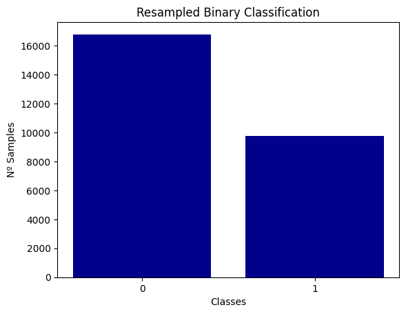

# Skin mole detection application

# Description  
The health company **"skinCare"** wants to create a simple web page where the user could upload a picture of the mole and see the result.  

# Installation

## Python version
* Python 3.7

## Packages used
* pandas==1.3.3
* Pillow==8.3.2
* streamlit==0.88.0
* tensorflow-gpu==2.5.0
* keras
* cv2
* sklearn.metrics

# Usage 
| File | Description |
|:---|:---|
|app.py|used for streamlit application|
|skin_cancer_model.py|used for streamlit backend function file|
|models/base_model_v5.h5|saved cnn model|
|models/keras_model_skin_or_else|saved model for streamlit application|

# Data Source
Dataset: The [__HAM10000__](https://dataverse.harvard.edu/dataset.xhtml?persistentId=doi:10.7910/DVN/DBW86T)

# Data Visualization

**nv** - Melanocytic nevi 
**mel** - Melanoma 
**bkl** - Benign keratosis-like lesions 
**bcc** - Basal cell carcinoma 
**akiec** - Actinic keratoses and intraepithelial carcinoma 
**vasc** - Vascular lesions 
**df** - Dermatofibroma 

**0** - Not Cancer 
**1** - Cancer
# Model Performance
## Model Arquitecture

# Model History

# Model Evaluation

# Website
https://skin-cancer-application.herokuapp.com/

# Contributors
|Name|Github|
|:---|:---|
| Anne Jungers|https://github.com/annejungers|
|Jayesh Italiya|https://github.com/JayeshItaliya86|
|Jose Roldan|https://github.com/Roldan87|
|Logan Vendrix|https://github.com/lvendrix|

# Timeline
20/09/2021-24/09/2021

