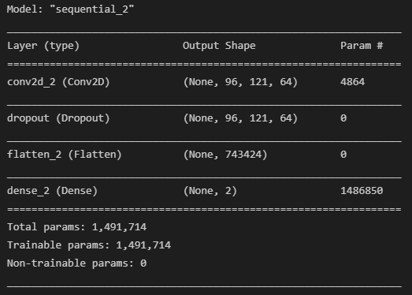
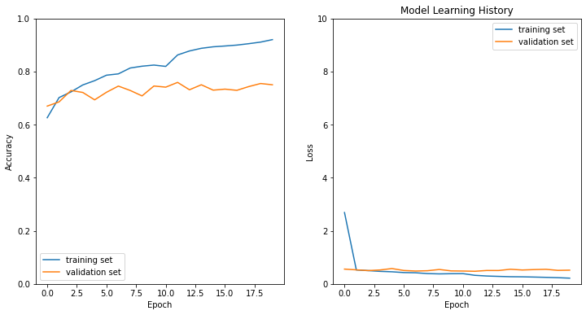

# SKIN MOLE DETECTION APP

# Description  
The health company **"skinCare"** wants to create a simple web page where the user could upload a picture of the mole and see the result.  

# Installation

## Python version
* Python 3.7

## Packages used
* pandas==1.3.3
* Pillow==8.3.2
* streamlit==0.88.0
* tensorflow-gpu==2.5.0
* cv2
* sklearn

# Usage 
| File | Description |
|:---|:---|
|cnn_model.py|Keras Neural Network (python file)|
|data.py|Data pre-processing (python file)|
|app @ 5720816|herokuapp folder|

# Data Source
Dataset: The [__HAM10000__](https://dataverse.harvard.edu/dataset.xhtml?persistentId=doi:10.7910/DVN/DBW86T)
* Nº Samples: 10.015

# Data Visualization

**nv** - Melanocytic nevi 
**mel** - Melanoma 
**bkl** - Benign keratosis-like lesions 
**bcc** - Basal cell carcinoma 
**akiec** - Actinic keratoses and intraepithelial carcinoma 
**vasc** - Vascular lesions 
**df** - Dermatofibroma 

| Not Cancer  | Cancer |
|---------|------------|
|**akiec** | **bcc**  |
|**df** | **mel**     |
|**bkl**     |     |
|**nv** |      |
|**vasc**     |    |

## Data Augmentation

* Flip Vertical
* Mirror
* Rotate 45º 
* **Total Nº Samples = 26.538**

**0** - Not Cancer (16.776) 
**1** - Cancer (9.762)
# Model Performance

## Model Architecture

# Model History

# Model Evaluation

## Metrics:
| Metric | Value |
|:---|:---|
|Test Accuracy|0.75|
|Test Loss|0.5|
|Validation Acc|0.75|
|Validation Loss|0.5|

# Website
https://skin-cancer-application.herokuapp.com/

# Contributors
|Name|Github|
|:---|:---|
| Anne Jungers|https://github.com/annejungers|
|Jayesh Italiya|https://github.com/JayeshItaliya86|
|Jose Roldan|https://github.com/Roldan87|
|Logan Vendrix|https://github.com/lvendrix|

# Timeline
20/09/2021-24/09/2021

